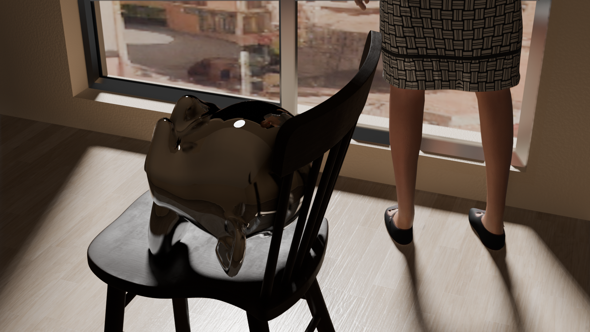
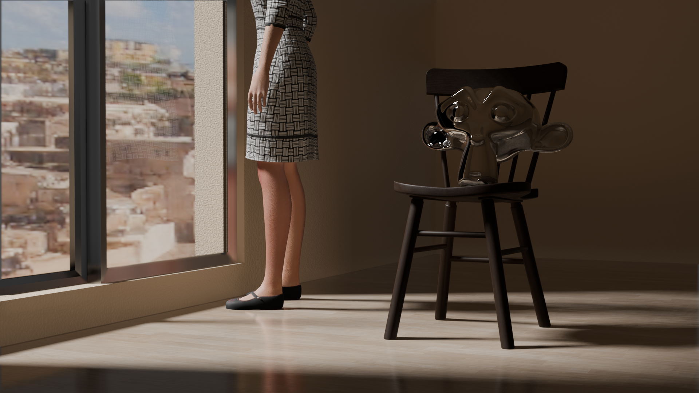

## Eevee lighting

I used Reflection Cubemap, Reflection Plane and Irradiance Volume for indirect lighting.

3D models used in the scene:
- The lady was generated by MPFB2.
- The chair was creaed by me.
- The landscape was generated by [AUTOMATIC1111 Stable Diffusion web UI](https://github.com/AUTOMATIC1111/stable-diffusion-webui).

Reference: [How to make Realtime Archviz with Blender and Eevee](https://youtu.be/2VNztZdfGZY)

