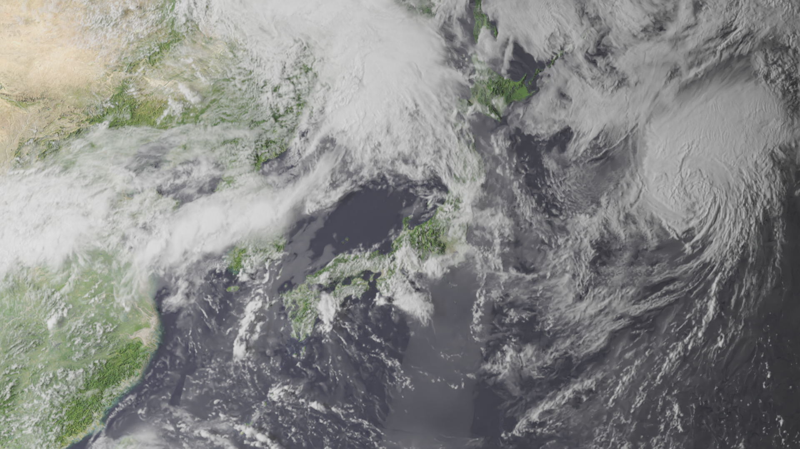
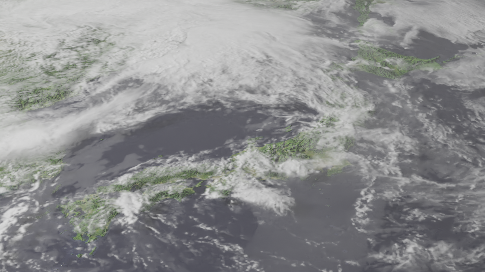

# NASA

## Earth

### Japan

Reference: [How to Make a Realistic Earth in Blender in 20 mins](https://youtube.com/watch?v=0YZzHn0iz8U&si=EnSIkaIECMiOmarE)

## Moon

Reference: [How to Make a Realistic Moon in Blender (Beginner Tutorial)](https://youtube.com/watch?v=3dlSLviiX70&si=EnSIkaIECMiOmarE)

### Moon

### Tycho

### Copernicus

### Mare

## Moon Surface

I made use of geometry nodes to scatter the rocks on the moon ground.

Reference: [How to Scatter Objects WITH GEOMETRY NODES in 2023! (Blender Tutorial)](https://www.youtube.com/watch?v=iNU-1ORXw74)

Starmap source: https://svs.gsfc.nasa.gov/3895

