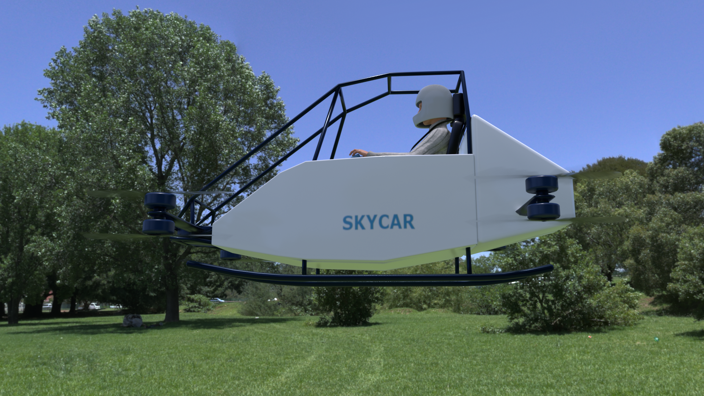
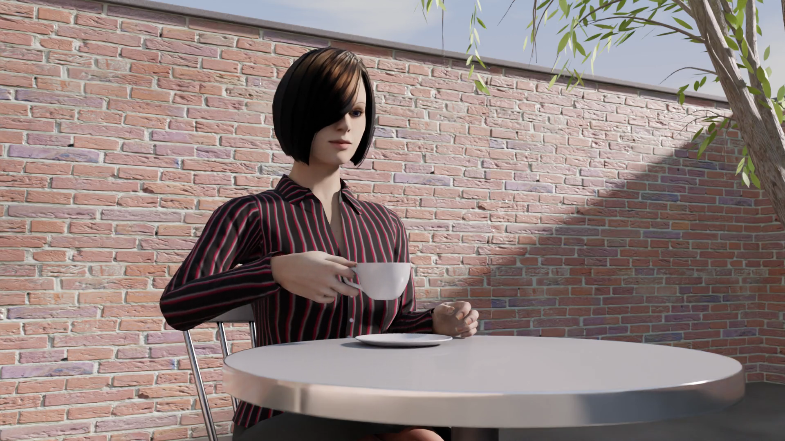
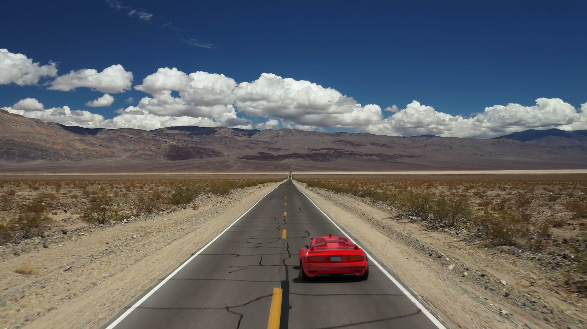
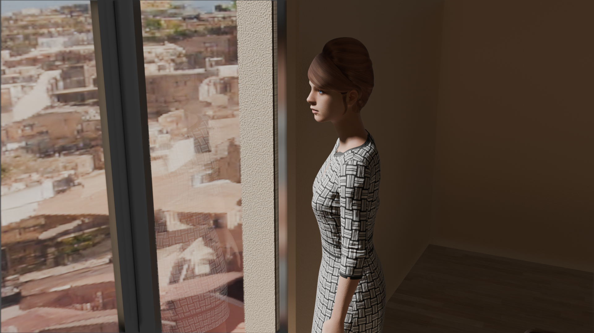

# 3DCG made with Blender

I use Blender with MacBook Air M1 2020 for developing MVP (Minimum Viable Product) to materialize a new idea at work. This repo is a collection of my hobby works made with Blender.

<table>
  <tr>
    <td>
      
    </td>
    <td>
      
    </td>
  </tr>  
    <tr>
    <td>
      
    </td>
    <td>
      
    </td>
  </tr>
</table>
    
## My original 3DCG works

### 3DCG scenes

- [Scenes](./scenes)

### Panorama

- [Panorama](./docs) (Work in progress)

### Animations

- [Animation Excercises](./excercises)

### Photoreal and Generative AI

- [VFX and Stable Diffusion](./VFX)
- [Indirect lighting and reflection with Eevee](./EeveeLighting)
- [SKYCAR(eVTOL)](./eVTOL)
- [Illumination](./illumination)
- [HDRI test](./hdri)
- [Smoke](./smoke)
- [Liquid](./liquid)

### 3D models

- [Robots](./robots)
- [Tools](./tools)
- [Human body](./human_body)
- [MakeHuman](./makehuman)
- [NASA](./NASA)
- [Furnitue](./furniture)
- [Environment](./environment)
- [Materials](./materials)

### Audio

- [Testing Blender's speakers](audio/speakers)

### Tips

- [Tips](./tips)
- [Baking normal map](./bake_normal)

### The other 3D models I created in the past

- [My other original 3D models](./my_original)
- [Free 3D models (I made some modifications on these models)](./modified)
- [Video](./doc/VIDEO.md)
- [3D model viewer](https://araobp.github.io/blender-3d/gltf/viewer.html).

## Data sources

In this project, I use free 3D models, 3D animation and textures from these sites:

- Free 3D models and 3D animations: [Mixamo](https://www.mixamo.com/)
- [Open IFC Model Repository](http://openifcmodel.cs.auckland.ac.nz/)
- [3D Warehouse](https://3dwarehouse.sketchup.com/)
- Free textures: [AmbientCG](https://ambientcg.com/)
- Free photos: [ISO Republic](https://isorepublic.com/)

## Dependencies (Blender add-on)

Part of the 3D models in this repo are dependent on the following add-ons:

- [MPFBv2 Alpha3](http://static.makehumancommunity.org/mpfb/releases/release_20a3.html)
- [BlenderBIM](https://blenderbim.org/)

## References

#### Rendering performance

- [Introducing the Blender Metal Viewport](https://code.blender.org/2023/01/introducing-the-blender-metal-viewport/?utm_source=www-homepage)

#### Visual effects

- [Volumetric Rendering in Blender for Absolute Beginners](https://www.youtube.com/watch?v=xP5MuZOjfew)

#### Human bodies

- [How to combine and edit Mixamo animations in Blender?](https://youtu.be/fLfjHzJy2A0)
- [Blender Rigify - Fingers bend the wrong way (FIXED)](https://youtu.be/Lw32kq4Q7Ag)

#### Inverse Kinematics

- [Inverse Kinematics - Blender 2.80 Fundamentals](https://youtu.be/S-2v_CKmVE8)
- [How to rig this excavator?](https://blender.stackexchange.com/questions/247317/how-to-rig-this-excavator)
- [Blender Rigging - Setting Up an IK Arm Rig](https://youtu.be/vZaNZhAoMts)

#### Excavator tracks

- [Excavator Track Link Chain Assembly In blender | Excavator Track Link Chain 3D | Blender Tutorial !](https://youtu.be/1sUpFJrLLXA)
- [MAKE TANK TRACKS IN BLENDER EASY](https://youtu.be/FqfIfEx5Eb8)
