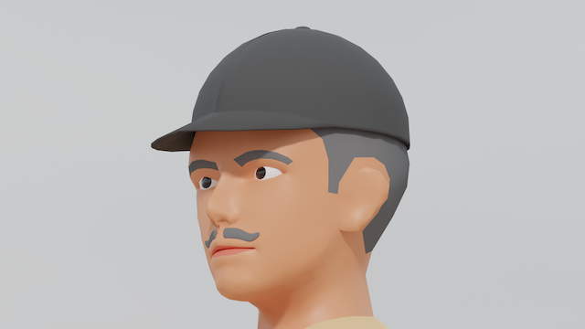
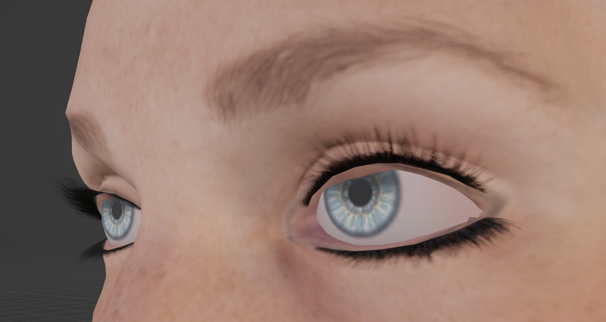
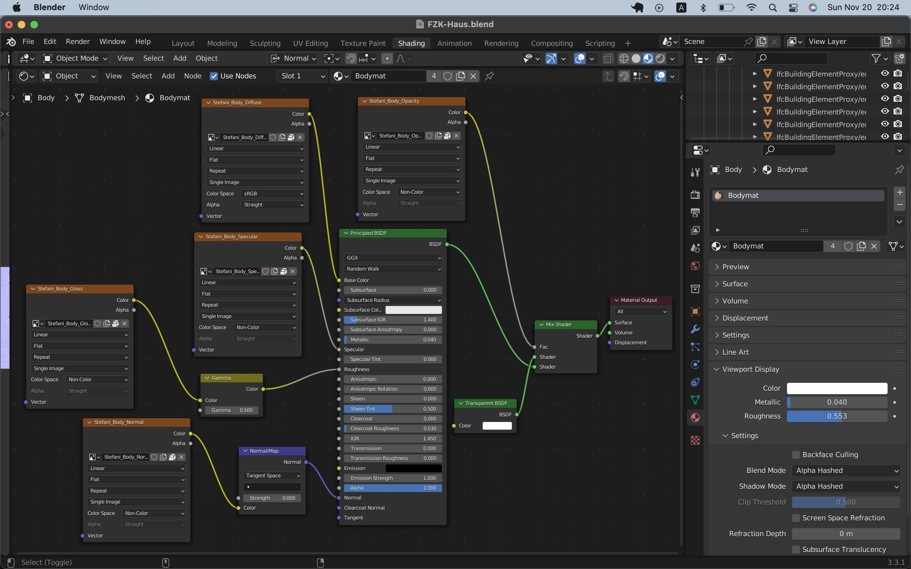

# Blender 3D

This repo is a collection of 3D models and 3D animations made with Blender by me.

Github pages (static web site) of this project:
https://araobp.github.io/blender-3d/

<table>
  <tr>
    <td>

    </td>
    <td>

    </td>
  </tr>

  <tr>
    <td>
      
    </td>
    <td>
      
    </td>
  </tr>  
</table>
    
## Dependencies (Blender add-on)

- [BlenderBIM](https://blenderbim.org/)
- Rigify

## 3D models

- [My original 3D models](./my_original)
- [Free 3D models from Mixamo etc (I made some modifications on those)](./modified)
- [Rigged models](./rigged_models)
- [NASA](./NASA)
- [Tips](./tips)

## Eyelashes with tranparent PNG texture

## PTZ Camera

[PTZ Camera](./my_original/ptz_camera.blend)

## AR Origin

This 3D model is useful for AR applications made with Unity.

[AR Origin](./my_original/origin.blend)

### Data sources

In this project, I use free 3D models, 3D animation and textures from these sites:

- Free 3D models and 3D animations: [Mixamo](https://www.mixamo.com/)
- [Open IFC Model Repository](http://openifcmodel.cs.auckland.ac.nz/)
- [3D Warehouse](https://3dwarehouse.sketchup.com/)
- Free textures: [AmbientCG](https://ambientcg.com/)

## References

- [Volumetric Rendering in Blender for Absolute Beginners](https://www.youtube.com/watch?v=xP5MuZOjfew)
- [How to combine and edit Mixamo animations in Blender?](https://youtu.be/fLfjHzJy2A0)
