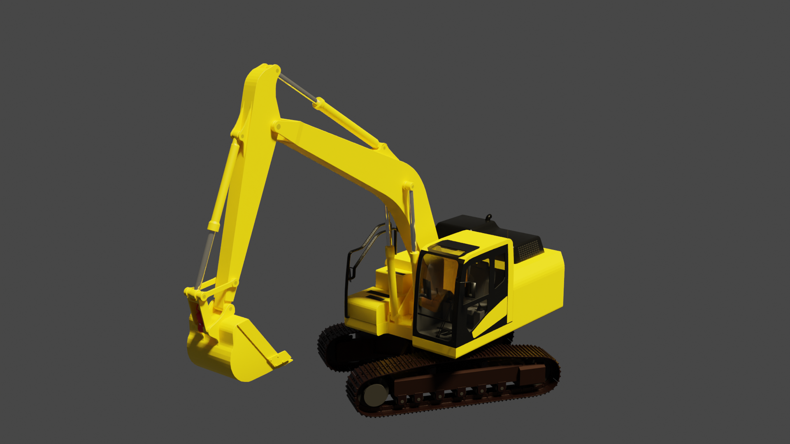
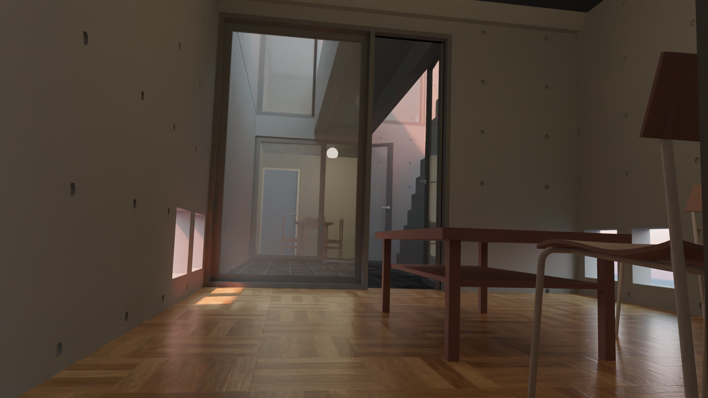
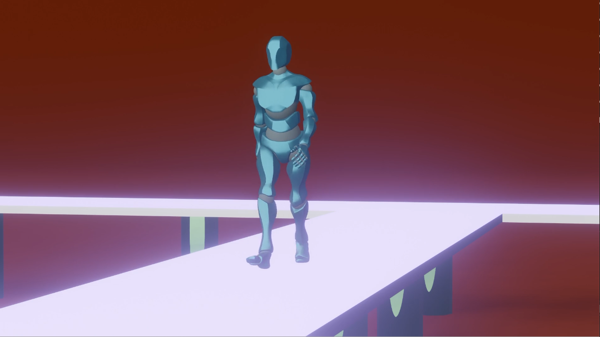
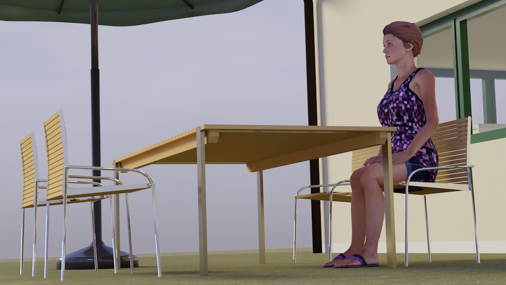
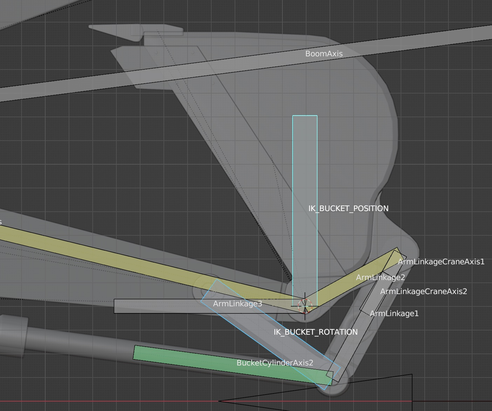
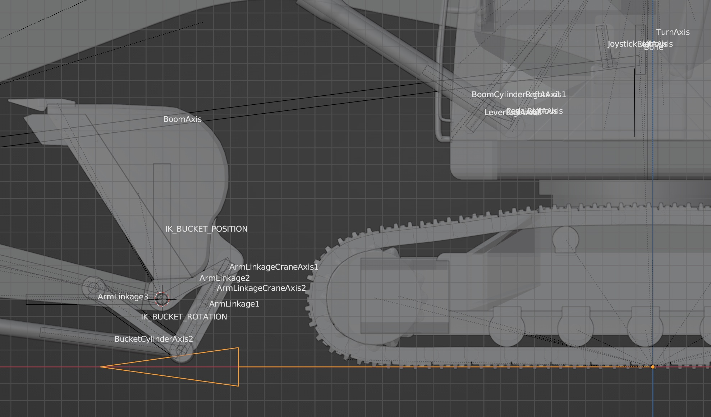
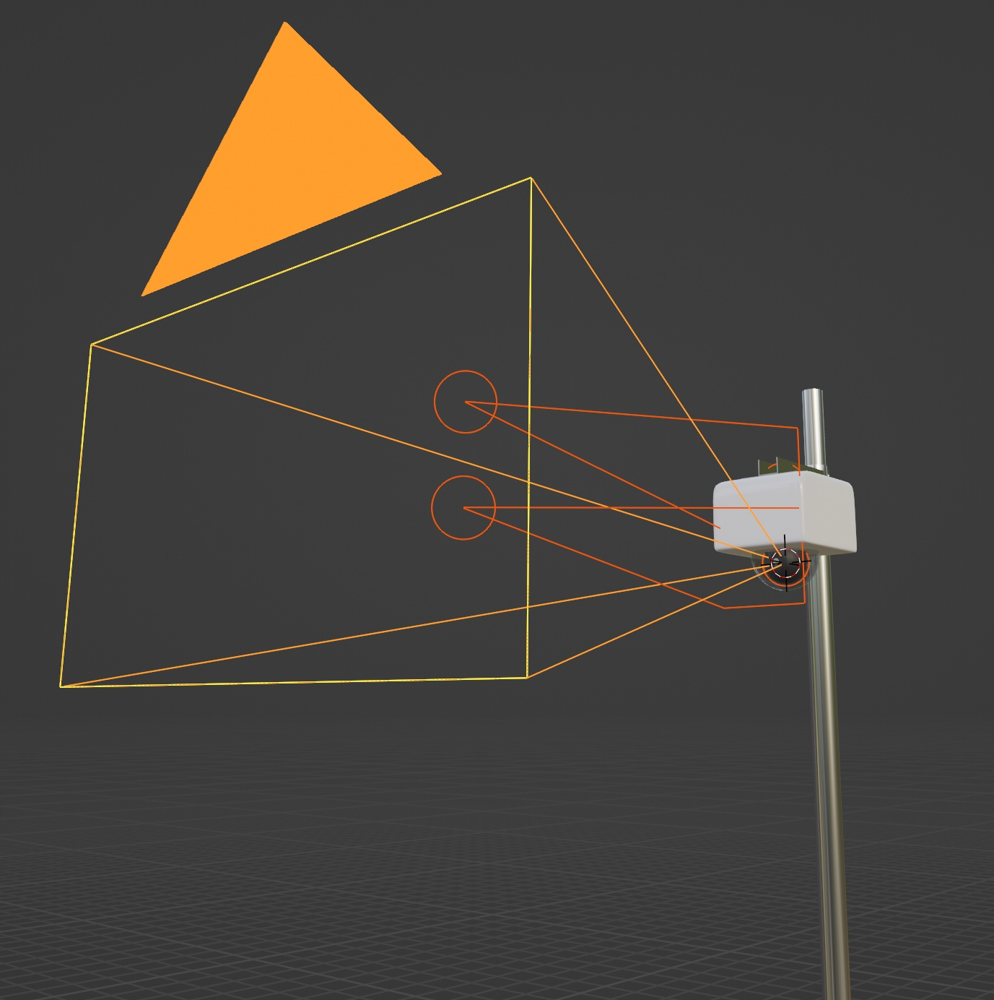
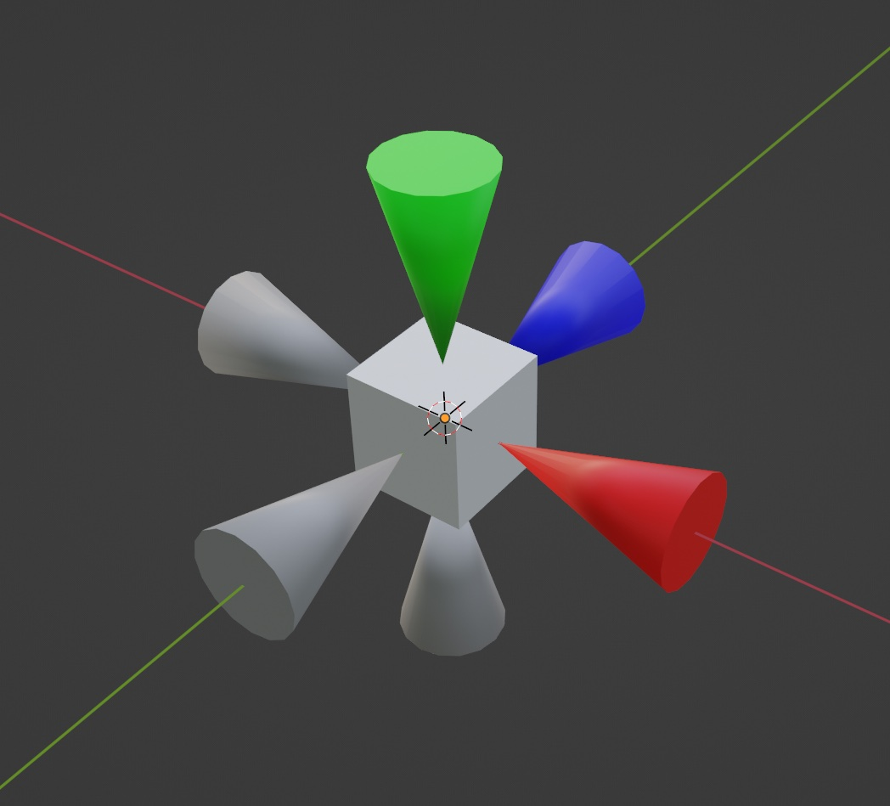

# Blender 3D

This repo is a collection of 3D models and 3D animations made with Blender by me.

<table>
  <tr>
    <td>

    </td>
    <td>

    </td>
  </tr>

  <tr>
    <td>
      
    </td>
    <td>
      
    </td>
  </tr>  
</table>
    
## Dependencies (Blender add-on)

- [BlenderBIM](https://blenderbim.org/)
- Rigify

## 3D models

#### My original 3D models

- [My original 3D models](./my_original)
- [My original human body 3D model](./human_body)
- [NASA](./NASA)
- [Illumination](./illumination)

#### Free 3D models from Mixamo etc (I made some modifications on those)

- [Free 3D models](./modified)
- [Rigged models](./rigged_models) (Work in progress)

#### IFC-BIM on Blender

- [FZK Haus](./modified/FZKHaus.md)
- [Azuma House](./modified/AzumaHouse.md)

#### Sky Car from Unity Standard Assets

- [SkyCar](./modified/SkyCar.md)

#### Tips

- [Tips](./tips)

## Video (animations) and pictures generated with Blender

#### Video (animations)

=> [Video](./doc/VIDEO.md)

#### Other pictures

Part of the models in this repo can be viewed via this [3D model viewer](https://araobp.github.io/blender-3d/gltf/viewer.html).

## Excavator 3D model "PC120_IK.blend"

Use "IK_BUCKET_POSITON" and "IK_BUCKET_ROTATION" bones for moving and rotating the bucket.

Use "EmptyForward" object to move the body.

## PTZ Camera

[PTZ Camera](./my_original/ptz_camera.blend)

## AR Origin

This 3D model is useful for AR applications made with Unity.

[AR Origin](./my_original/origin.blend)

## Data sources

In this project, I use free 3D models, 3D animation and textures from these sites:

- Free 3D models and 3D animations: [Mixamo](https://www.mixamo.com/)
- [Open IFC Model Repository](http://openifcmodel.cs.auckland.ac.nz/)
- [3D Warehouse](https://3dwarehouse.sketchup.com/)
- Free textures: [AmbientCG](https://ambientcg.com/)

## References

#### Visual effects

- [Volumetric Rendering in Blender for Absolute Beginners](https://www.youtube.com/watch?v=xP5MuZOjfew)

#### Human bodies

- [How to combine and edit Mixamo animations in Blender?](https://youtu.be/fLfjHzJy2A0)
- [Blender Rigify - Fingers bend the wrong way (FIXED)](https://youtu.be/Lw32kq4Q7Ag)

#### Inverse Kinematics

- [Inverse Kinematics - Blender 2.80 Fundamentals](https://youtu.be/S-2v_CKmVE8)
- [How to rig this excavator?](https://blender.stackexchange.com/questions/247317/how-to-rig-this-excavator)
- [Blender Rigging - Setting Up an IK Arm Rig](https://youtu.be/vZaNZhAoMts)

#### Excavator tracks

- [Excavator Track Link Chain Assembly In blender | Excavator Track Link Chain 3D | Blender Tutorial !](https://youtu.be/1sUpFJrLLXA)
- [MAKE TANK TRACKS IN BLENDER EASY](https://youtu.be/FqfIfEx5Eb8)
