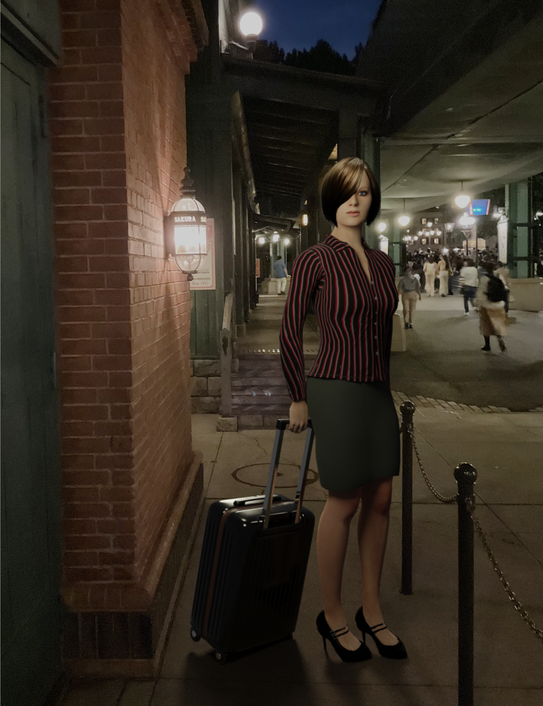
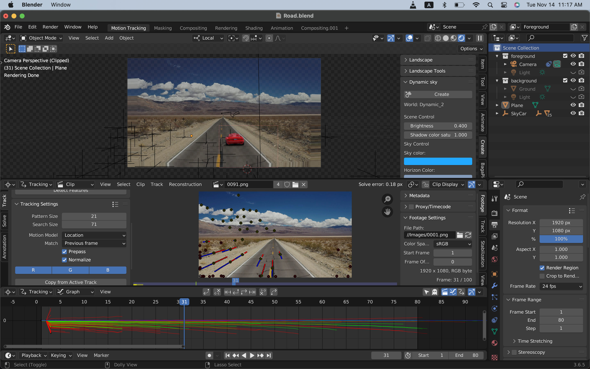
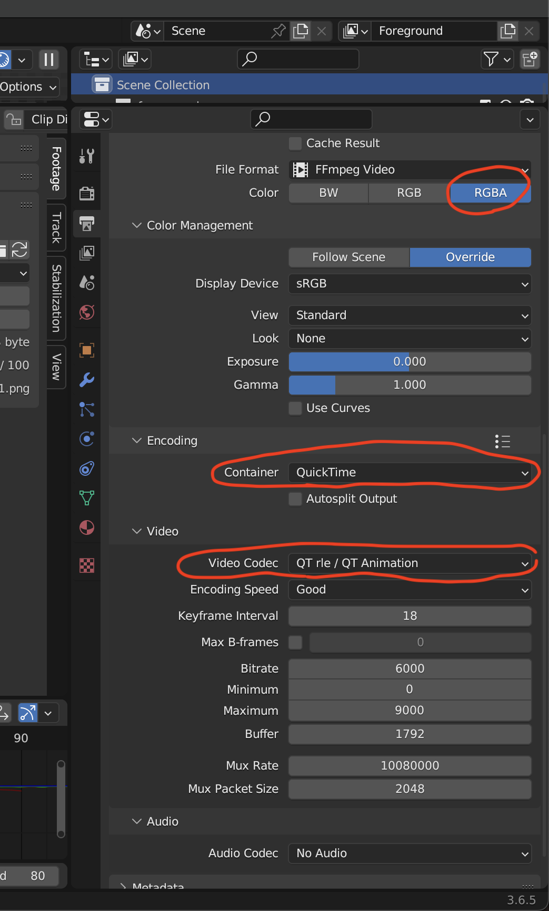
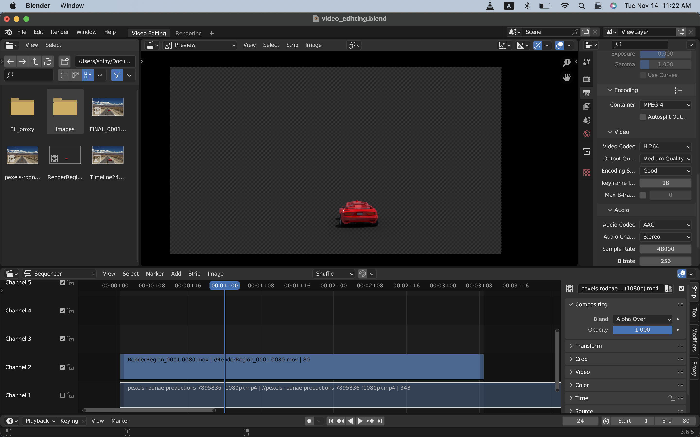

# VFX

## Lady in Disney Sea

This is my first VFX work.

=> [Disney Sea](./DisneySea)

<table>
  <tr>
    <td>
      
    </td>
    <td>
      
    </td>
  </tr>
</table>

### Chainging clothes with Stable Diffusion Inpaint (Generative AI)

I ran Stable Diffusion Web UI [AUTOMATIC1111](https://github.com/AUTOMATIC1111/stable-diffusion-webui) on my Mac to change the clothes.

<table>
  <tr>
    <td>
      
    </td>
    <td>
      
    </td>
    <td>
      
    </td>
  </tr>
</table>

### 3D models used in the scene

- I used MPFB2 to generate the lady.
- I modeled the suit case and took the background picture by myself.

### Credits

I have used MakeHuman extensions, "High heels" and "Nails", from the following pages:

- High heels: http://www.makehumancommunity.org/clothes/high_heels_library.html
- Nails: http://www.makehumancommunity.org/clothes/mind_nails_02_medium.html

## Shinjuku, Tokyo

This is my second VFX work.

=> [Shinjuku](./Shinjuku)

<table>
  <tr>
    <td>
      
    </td>
    <td>
      
    </td>
  </tr>
</table>

### 3D models used in the scene

- I used MPFB2 to generate the lady.
- I modeled the eVTOL and took the background picture by myself.

## Road

I learned how to make a VFX movie from [this YouTube tutorial](https://youtu.be/o2uy7SDcQak).

https://github.com/araobp/blender-3d/assets/11053654/b4d2882a-06ee-445f-9a4e-7d29f6e13c69

### 3D models used in the scene

- Modified version of "SkyCar" originally designed by Unity
- Footage: https://www.pexels.com/video/drone-footage-of-a-desert-road-7895836/ 

## Tips

My MacBook Air is not so fast, so it takes a long time for rendering with Cycle.

I applied Render Region to the scene to render only a certain region, then I composited the output with a background scene.

