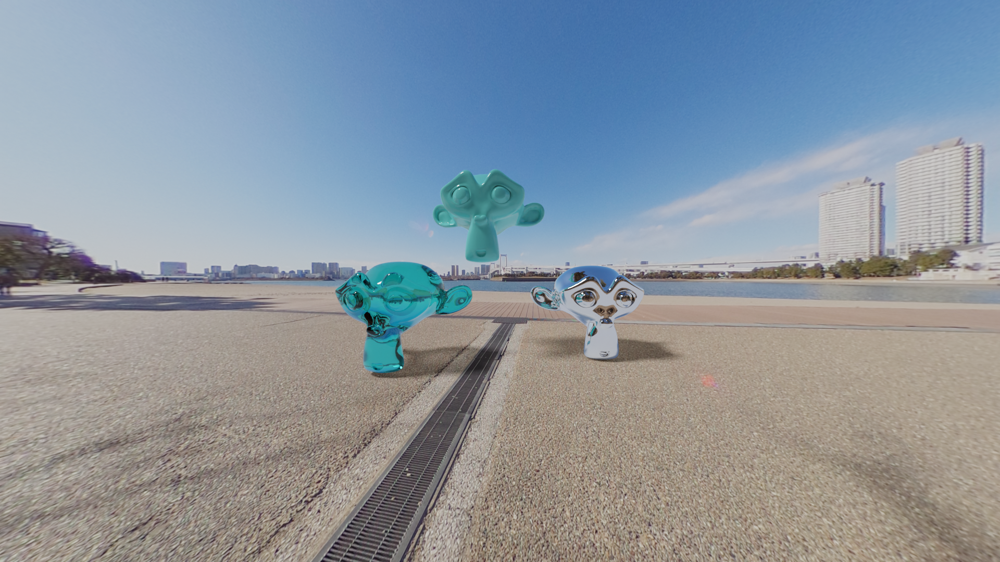
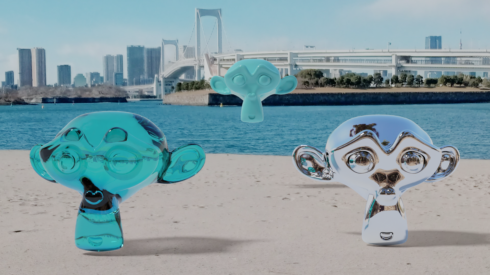

# HDRI test

I test my Ricoh Theat SC if it can be used for making a Blender's Environment Texture.

```
The camera's spec

ISO: 100 to 1600
Shutter speed: 1/8000 seconds to 1/8 seconds
```

The Sun light is saturated on the picture under the shortest exposure condition(shutter speed 1/8000 ISO 100), so I need to add a Sun light in the scene.

The location: Odaiba district in Tokyo.

## Video test

https://user-images.githubusercontent.com/11053654/215272993-5bfee5ff-270c-4e3a-9dc4-7452f17dbe3a.mp4

https://user-images.githubusercontent.com/11053654/215302675-0a591018-8234-4c19-83d1-679eac278b10.mp4

## Image test




## Image composition test



Reference:
- [Blender Tutorial: Make Your Own HDR Images (HDRI) using the Ricoh Theta SC(Part 1)](https://www.youtube.com/watch?v=Egq3UcIai8Q)
- [Blender Tutorial: Make Your Own HDR Images (HDRI) using the Ricoh Theta SC(Part 2)](https://www.youtube.com/watch?v=-4E181vPAkQ&t=744s)
