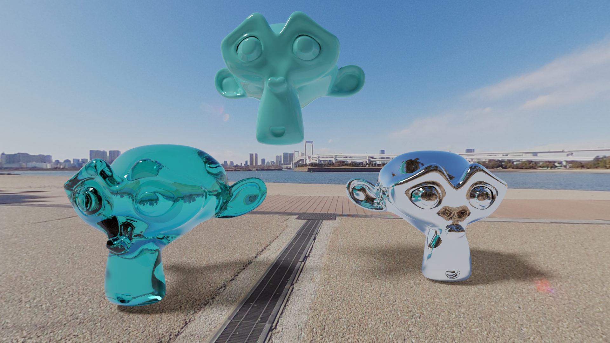
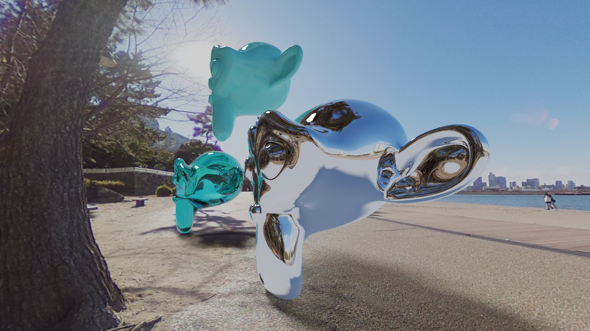
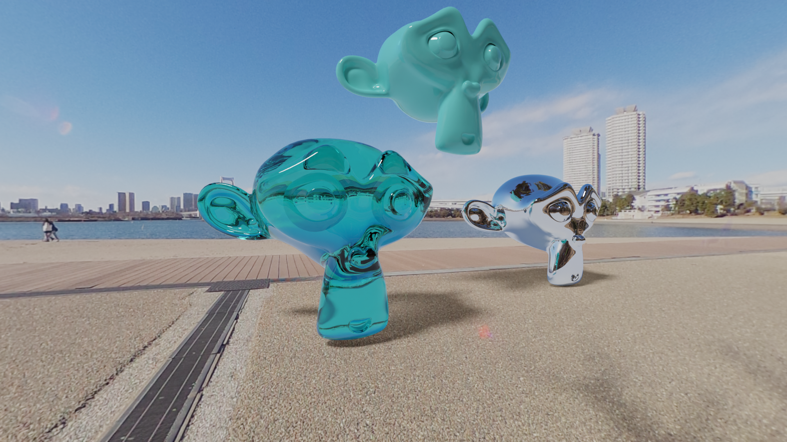

# HDRI test

I test my Ricoh Theat SC if it can be used for making a Blender's Environment Texture.

```
The camera's spec

ISO: 100 to 1600
Shutter speed: 1/8000 seconds to 1/8 seconds
```

The camera does not seem to have dynamic range high enough, so I need to add a Sun light in the scene.







Reference:
- [Blender Tutorial: Make Your Own HDR Images (HDRI) using the Ricoh Theta SC](https://www.youtube.com/watch?v=Egq3UcIai8Q)

