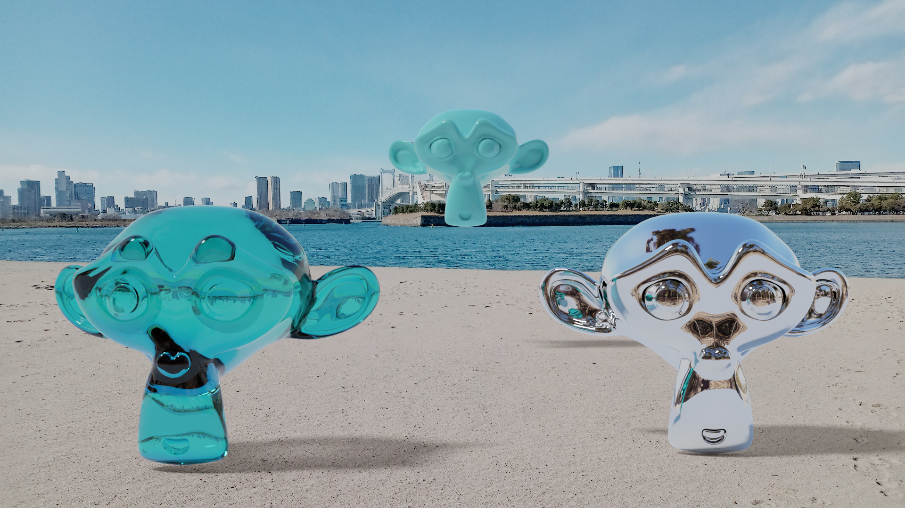

# HDRI test

I test my RICOH Theta SC to see if it can be used for making a Blender's Environment Texture.

```
The camera's spec

ISO: 100 to 1600
Shutter speed: 1/8000 seconds to 1/8 seconds
```

I used GIMP for merging images with three different exposures to create a HDR image.

The Sun light is saturated on the picture under the shortest exposure condition(shutter speed 1/8000 ISO 100), so I need to add a Sun light in the scene for casting shadows on the ground.

## Test 1

The location of the HDR image: Odaiba district in Tokyo.

### Video test (Suzanne)

https://user-images.githubusercontent.com/11053654/215272993-5bfee5ff-270c-4e3a-9dc4-7452f17dbe3a.mp4

https://user-images.githubusercontent.com/11053654/215302675-0a591018-8234-4c19-83d1-679eac278b10.mp4

### Image test


### Image composition test

The background image was taken by my smartphone.



Reference:
- [Blender Tutorial: Make Your Own HDR Images (HDRI) using the Ricoh Theta SC(Part 1)](https://www.youtube.com/watch?v=Egq3UcIai8Q)
- [Blender Tutorial: Make Your Own HDR Images (HDRI) using the Ricoh Theta SC(Part 2)](https://www.youtube.com/watch?v=-4E181vPAkQ&t=744s)

## Test 2

### Image composition test (Drone)

The location of the HDR image: a park in Kanagawa, Japan.

A Sun light was added in the scene to enhance the Drone's shadow.

Note that the shadow catcher is not a simple plane.

=> Video on YouTube: https://youtu.be/9N4XoviSjys

## EEVEE shadow catcher

The material below can be used as a shadow catcher for EEVEE.


