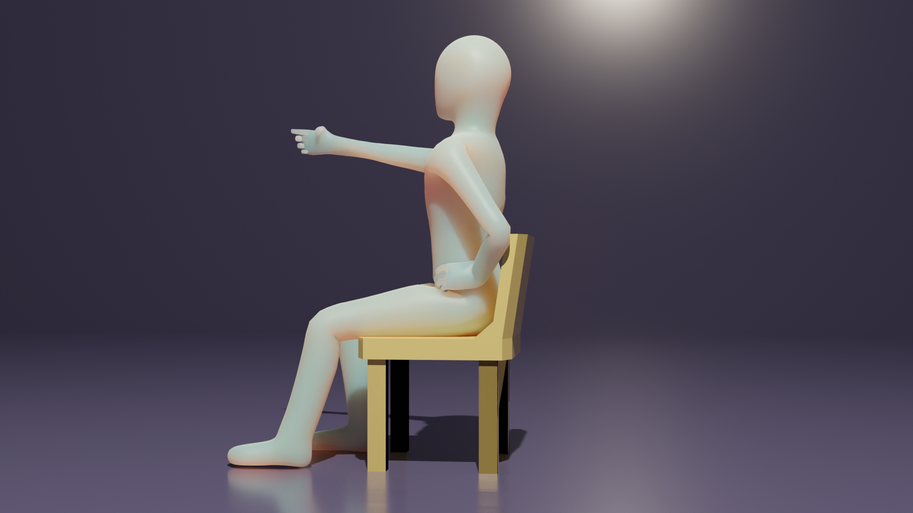
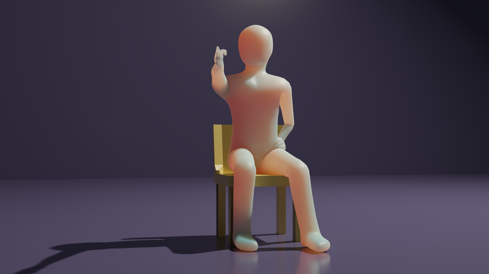

# Human body

This folder contains my original human body 3D model.

## Images from cameras

## Animation example

https://user-images.githubusercontent.com/11053654/206714520-69bff37b-5c52-4362-a3ab-f2a5d1870e44.mp4

## Reference

- [Character Modeling for Beginners (Blender Tutorial)](https://youtu.be/IhIGVO4fqLg)
