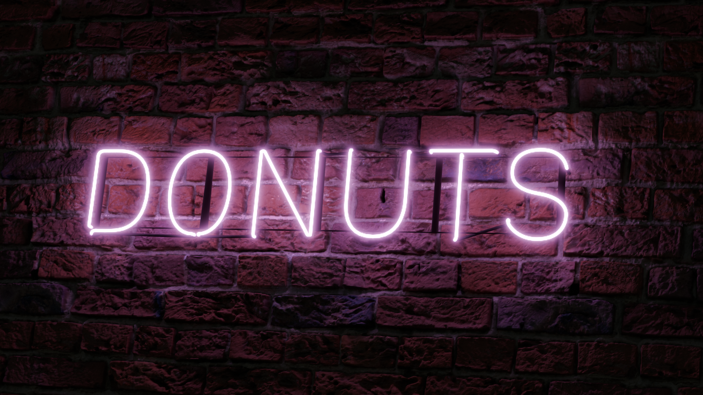
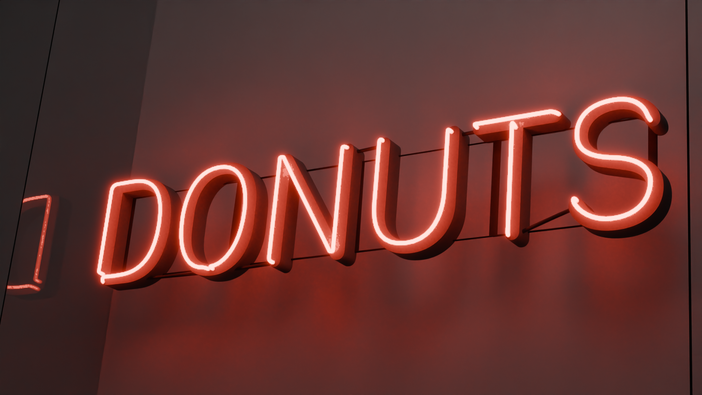
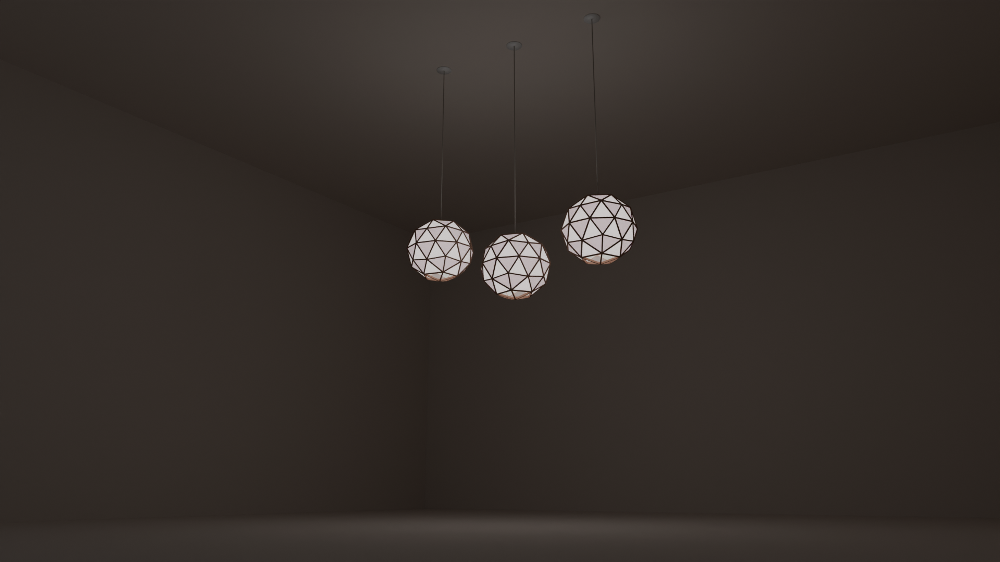
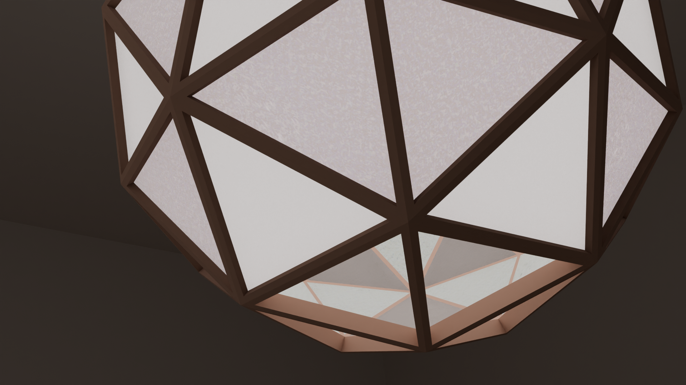
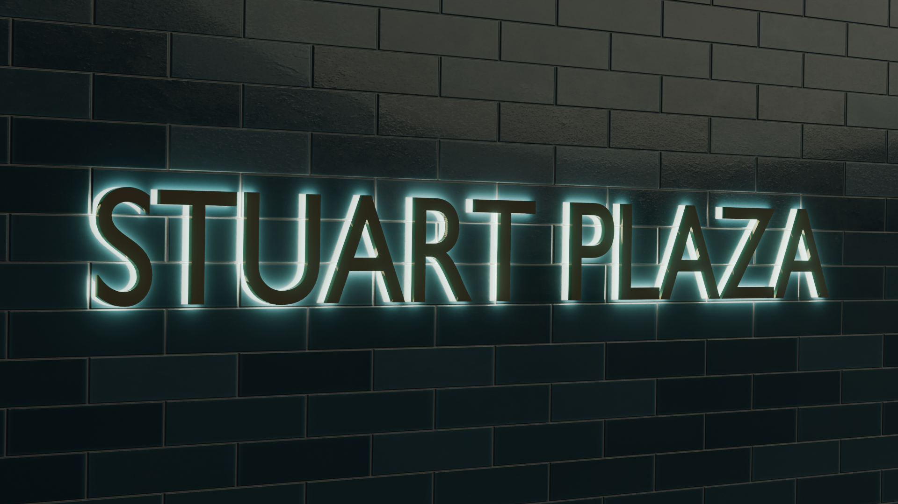
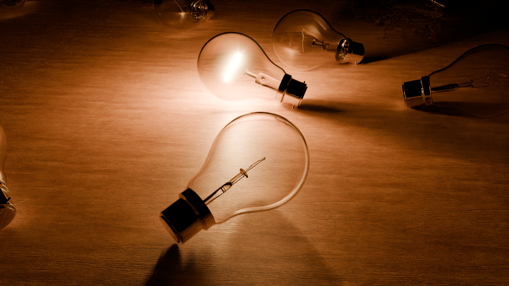

# Illumination 

## Neon signs

Reference: [How to Make a Neon Sign in Blender 2.8](https://youtu.be/eQjQfmjDXXA)
 

## Wooden lights

## Vintage apartment entrance

## Light bulb

Reference: [Beginner Blender Modelling Tutorial - Lightbulb Part 1 of 2](https://youtube.com/watch?v=W-wPIfSHMLM&si=EnSIkaIECMiOmarE)

## LED sign

Reference: [How to make an LED sign in Blender](https://youtube.com/watch?v=_TYD-CRDGXI&si=EnSIkaIECMiOmarE)

https://user-images.githubusercontent.com/11053654/208661969-d84ab927-a373-4f20-9b34-946c90f00442.mp4
