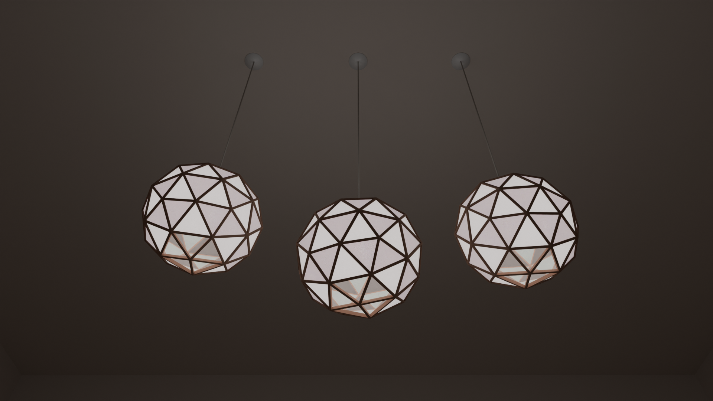

# Illumination 

## Neon signs (neon.blend, neon2.blend)

Reference: [How to Make a Neon Sign in Blender 2.8](https://youtu.be/eQjQfmjDXXA)
 

## Wooden lights (wooden_light.blend)

## Vintage apartment entrance (vintage_apartment.blend)

## LED sign (led.blend)

Reference: [How to make an LED sign in Blender](https://youtube.com/watch?v=_TYD-CRDGXI&si=EnSIkaIECMiOmarE)

https://user-images.githubusercontent.com/11053654/208661969-d84ab927-a373-4f20-9b34-946c90f00442.mp4

## Light bulb (lightbulb.blend)

Reference: [Beginner Blender Modelling Tutorial - Lightbulb Part 1 of 2](https://youtube.com/watch?v=W-wPIfSHMLM&si=EnSIkaIECMiOmarE)

## Christmas lights (christmas_light.blend)

## Spark (spark.blend)

Reference: [Making Sparks in Blender Beginner Tutorial](https://youtube.com/watch?v=8XFz-wqv3Kc&si=EnSIkaIECMiOmarE)

=>[Video on YouTube](https://youtu.be/pLNI8Rr72fw)
