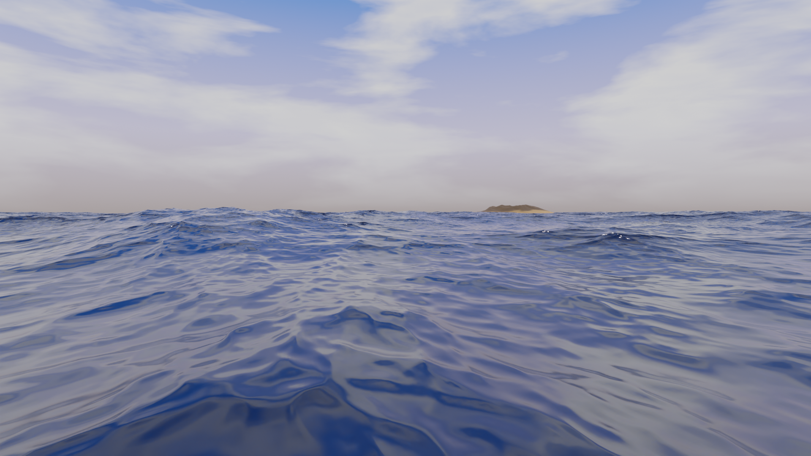

# Liquid

## coffee.blend

Reference: [Part 1, Level 3: Modelling - Blender Beginner Tutorial](https://youtu.be/7a0cHFs7jkw)

## ocean.blend

Reference: [[3.x] All Settings In Ocean Modifier In Blender | Explained With Suitable Examples | Eevee & Cycles](https://youtube.com/watch?v=n_Z2oMTdDdI&si=EnSIkaIECMiOmarE)

