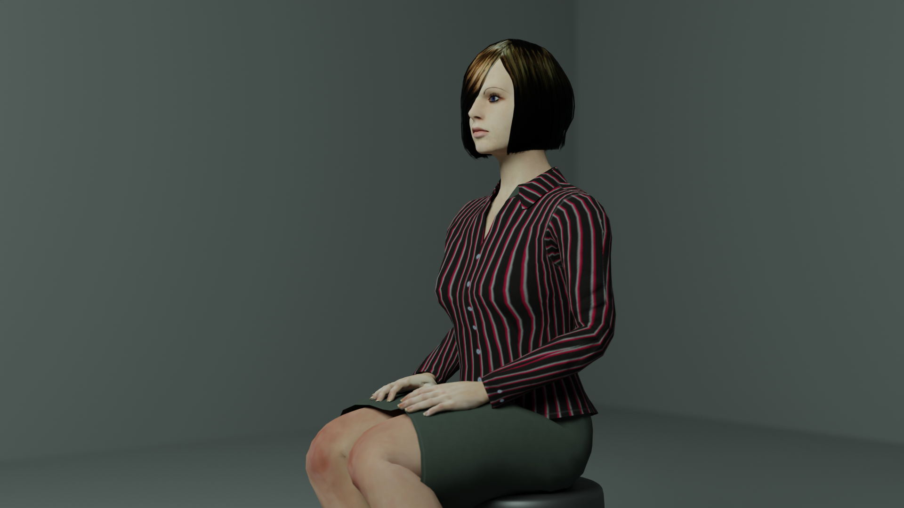
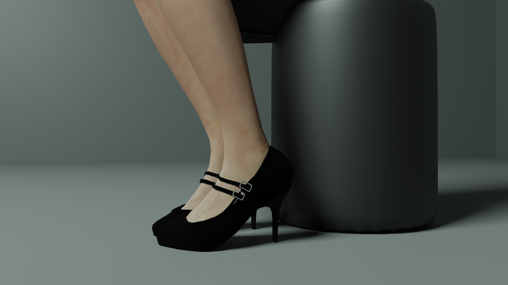
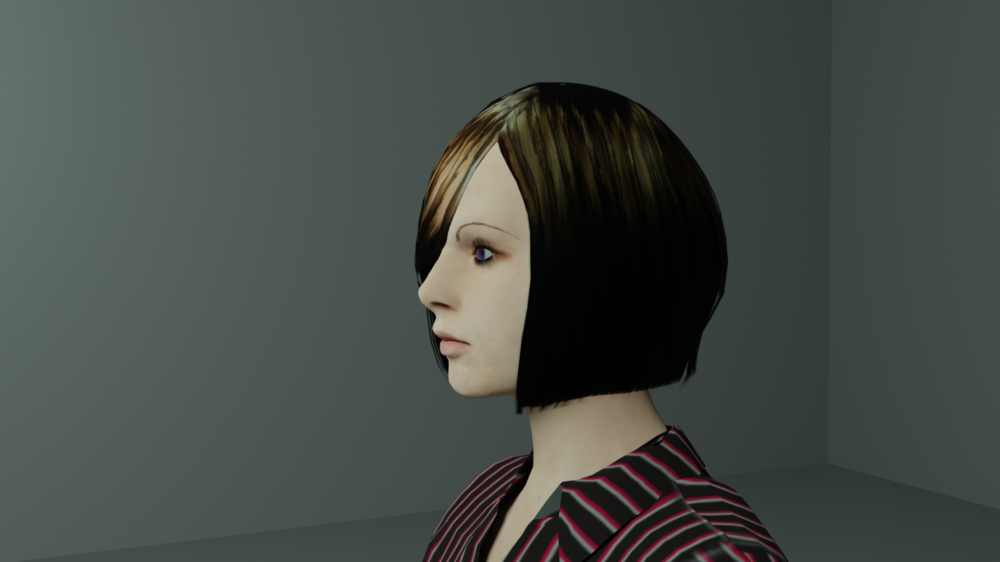

# MakeHuman

MakeHuman: http://www.makehumancommunity.org/

I made the following modifications on the model:
- modified the body shape
- added Metarig and Rigify
- splitted the teeth into an upper part and a lower part
- modified the shader of the eyeballs
- modified the shader of the hair to increase its Gamma value 
- disabled shadow on the hair

Reference:
- [Blender 3.0 Tutorial | Human Meta Rig | Including Face Rigging](https://www.youtube.com/watch?v=EA50BBo84uI)
- [How to remove shadow on object](https://cgian.com/2022/06/blender-no-shadow)

## A woman generated by MakeHuman with some parameters

### Credits

I have used MakeHuman extensions, "High heels" and "Nails", from the following pages:
- High heels: http://www.makehumancommunity.org/clothes/high_heels_library.html
- Nails: http://www.makehumancommunity.org/clothes/mind_nails_02_medium.html
