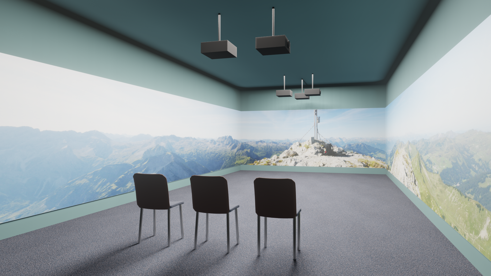
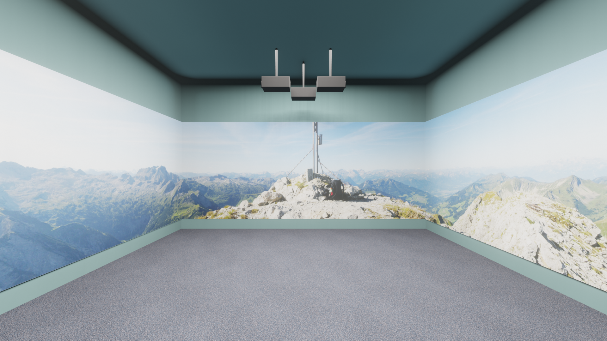
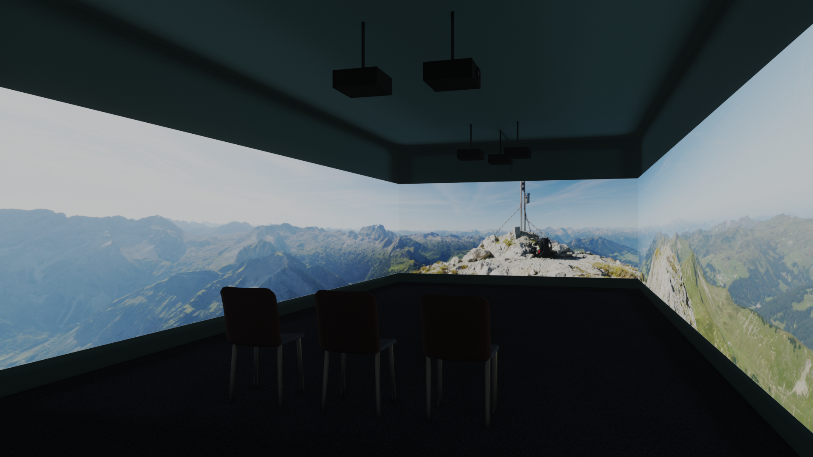
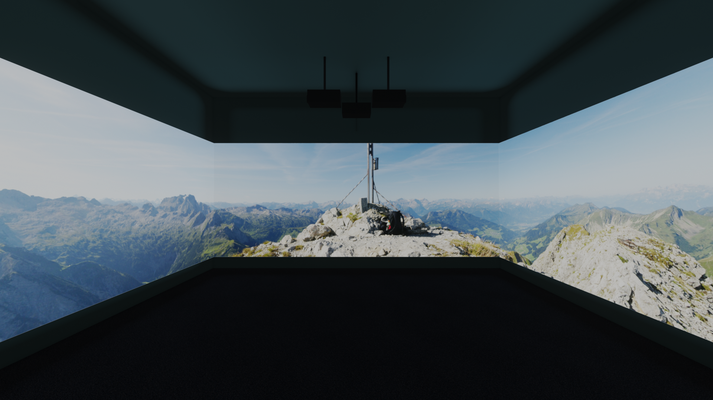

# Turning a conference room into a cinema theater

This is an experiment to show that any conference rooms can be turned into a wide-screen cinema theater with multiple projectors.

The landscape image is from https://upload.wikimedia.org/wikipedia/commons/e/e2/360%C2%B0_Panorama_Zitterklapfen.jpg

