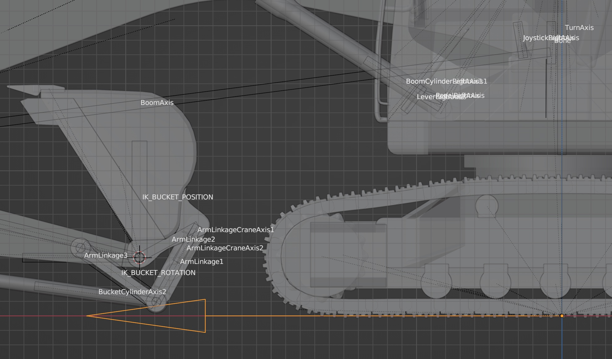

## Excavator 3D model "PC120_IK.blend"

Use "IK_BUCKET_POSITON" and "IK_BUCKET_ROTATION" bones for moving and rotating the bucket.

Use "EmptyForward" object to move the body.

## PTZ Camera

[PTZ Camera](./my_original/ptz_camera.blend)

