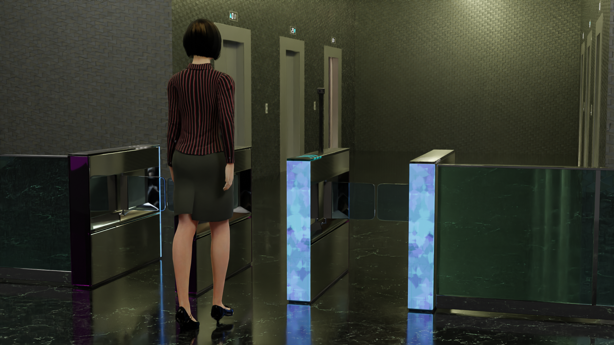
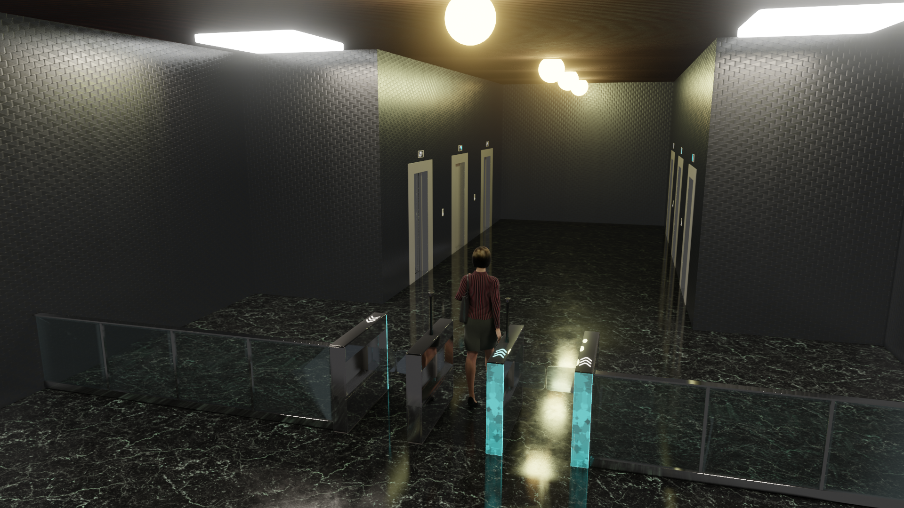
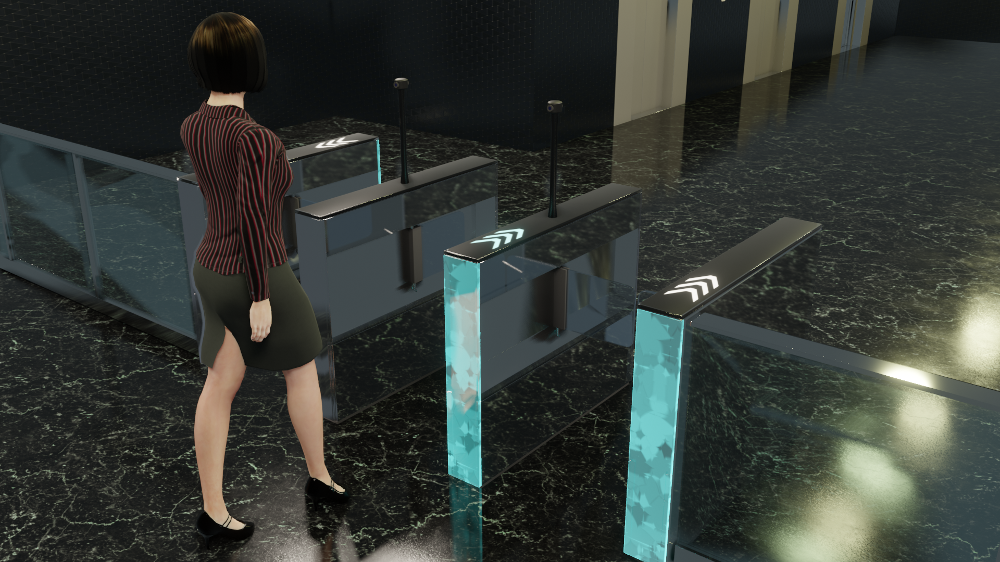
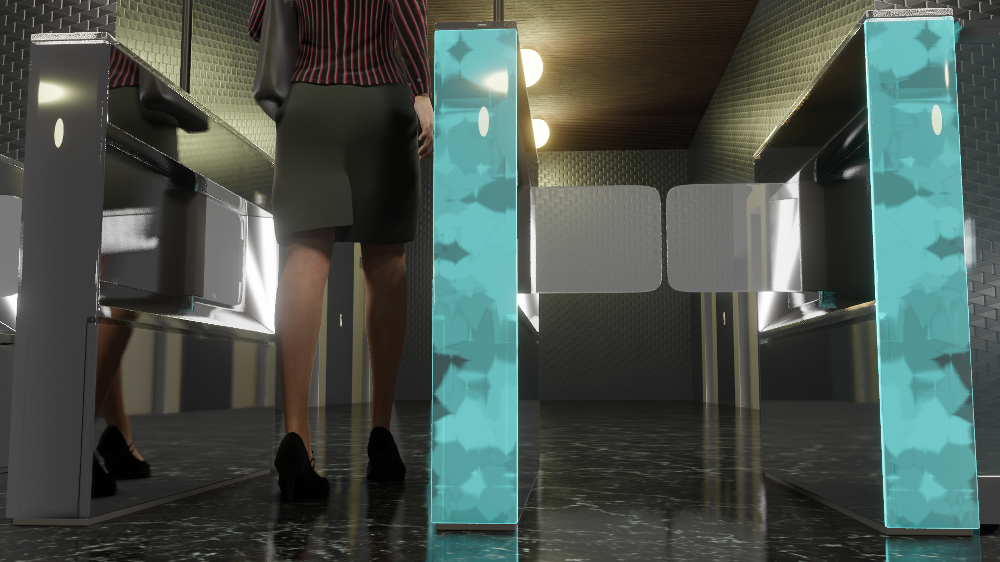
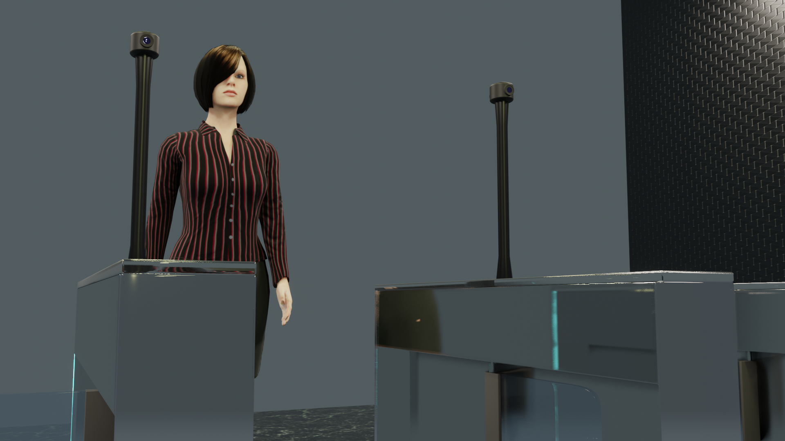
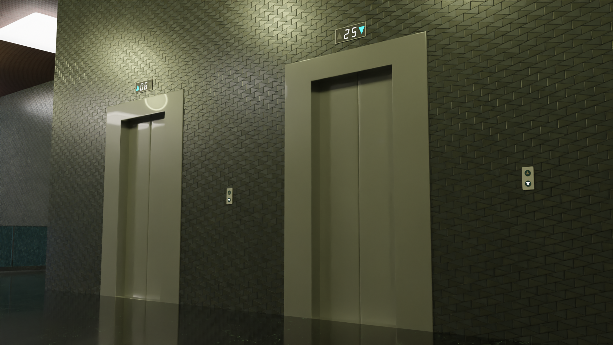
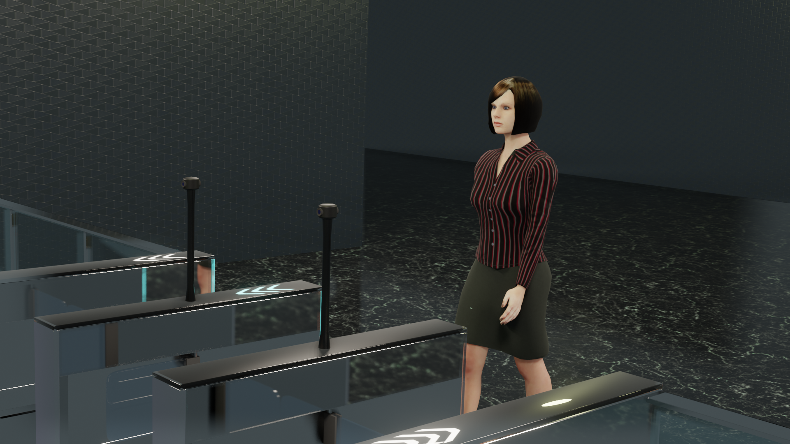
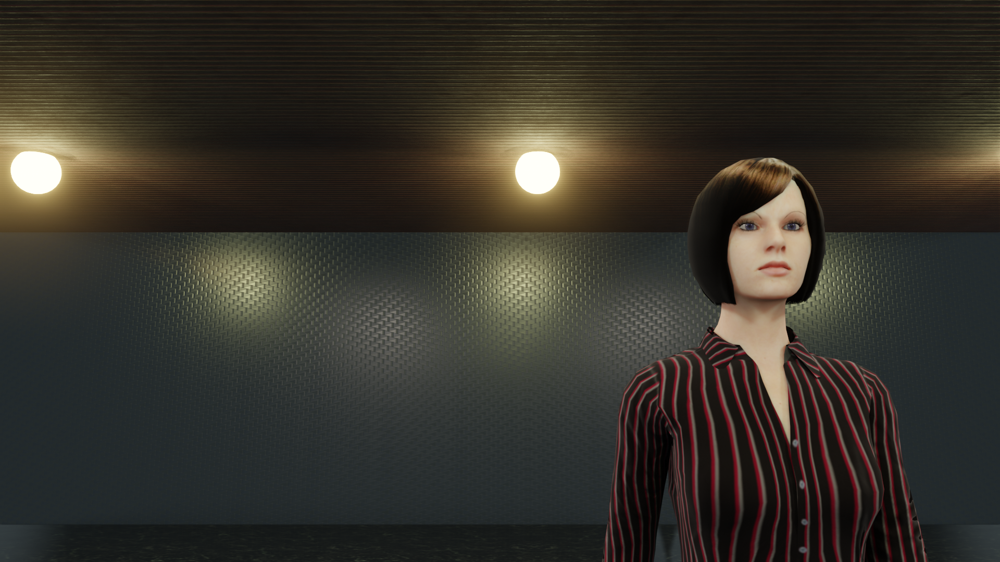
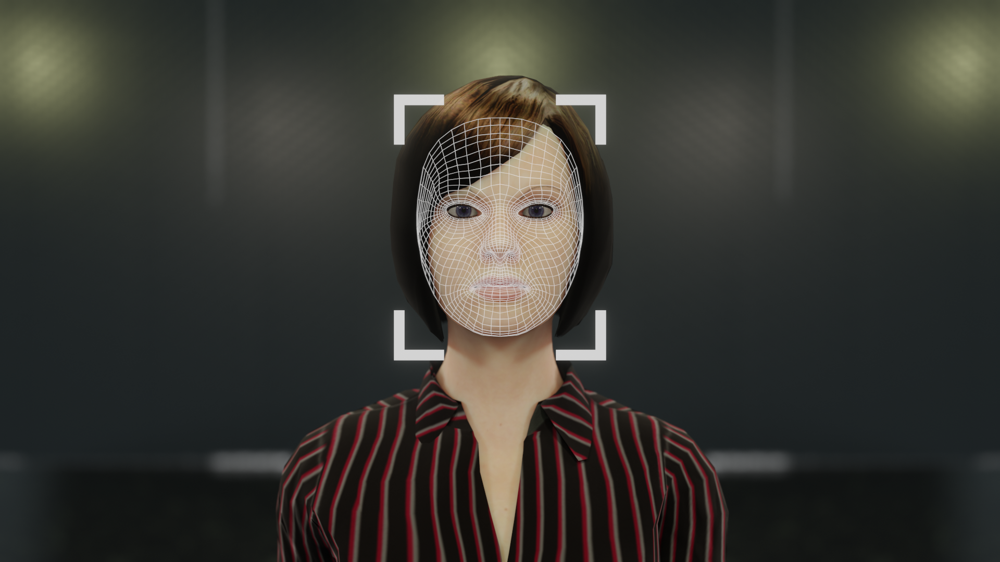

# Office Building

This is my first walk cycle animation.

This scene is rendered with Eevee.

References:

- [How to Make Eevee More Realistic (Blender Tutorial)](https://www.youtube.com/watch?v=jxQEPjPTJyw)
- [Realistic Glass Shader in Blender Eevee (Tutorial)](https://www.youtube.com/watch?v=JYyUMMboZFk)
- [High Heels Walk in Beverly Hills](https://www.youtube.com/watch?v=nuXZLcfOFqQ)
- [Time Node in Blender 2.81?](https://blender.stackexchange.com/questions/158837/time-node-in-blender-2-81)
- [3DCGアニメーション入門 (Book)](https://www.borndigital.co.jp/book/19710.html)

## Face Recognition Flip Barrier Gates

All the 3D models and animations have been created by me.
- The walking woman was created with Makehuman
- All the PBR materials are from AmbientCG

Credits:

I have used MakeHuman extensions, "High heels" and "Nails", from the following pages:

High heels: http://www.makehumancommunity.org/clothes/high_heels_library.html
Nails: http://www.makehumancommunity.org/clothes/mind_nails_02_medium.html

I have used the following sound sources from freesound.org in the scene:
- [Girl walking in heels.wav](https://freesound.org/people/CyrileneRossouw/sounds/407564/)
- [success.wav](https://freesound.org/people/grunz/sounds/109662/)
- [Elevator door 06.wav](https://freesound.org/people/LG/sounds/73122/)

## View from Face Recognition Cameras

